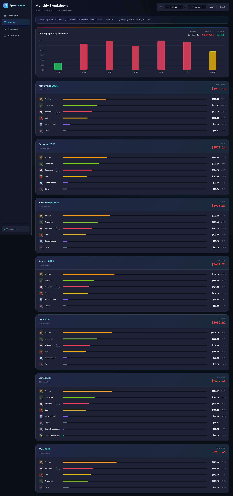

# SpendScope: Spending Analyzer

A professional spending analyzer webapp that helps you understand your financial habits through visual breakdowns of your credit card or bank account CSV exports.

## Screenshots

### Dashboard View


### Monthly Breakdown View


## Features

### 📊 Dashboard
- **Summary Statistics**: Total spent, total payments, transaction count, and average transaction
- **Spending Over Time**: Interactive bar chart with daily/weekly/monthly views
- **Category Breakdown**: Donut chart showing spending distribution by category
- **Top Merchants**: See where you spend the most
- **Recent Transactions**: Quick view of latest activity

### 📋 Transactions
- **Full Transaction List**: Paginated table of all transactions
- **Search**: Find transactions by description or category
- **Filter by Category**: Focus on specific spending categories
- **Filter by Type**: View only spending or only payments
- **Sortable Columns**: Sort by date, description, or amount
- **Export to CSV**: Download filtered transactions

### 📁 Import Data
- **Drag & Drop Upload**: Easy file upload interface
- **Load Existing Files**: One-click loading of CSV files in the project directory
- **Multiple File Support**: Load and combine multiple CSV files
- **Clear Data**: Start fresh when needed

### 🏷️ Automatic Categorization
Transactions are automatically categorized into:
- Food Delivery (Uber Eats, DoorDash, etc.)
- Rideshare (Uber, Lyft)
- Groceries (Costco, Instacart, etc.)
- Shopping (Amazon, etc.)
- Subscriptions (Netflix, Spotify, ChatGPT, etc.)
- Gas (Esso, Shell, etc.)
- Entertainment (Gaming, streaming)
- Restaurants
- Recreation (Gym, fitness)
- Fees & Interest
- Payments

## Getting Started

1. Start a local server in the project directory:
   ```bash
   python3 -m http.server 8888
   ```

2. Open your browser to `http://localhost:8888`

3. Either:
   - Upload your own CSV files via drag & drop
   - Click "Load All Files" to use the existing CSVs in the project

## CSV Format

The app expects CSV files in this format (no headers):
```
MM/DD/YYYY,Description,Debit Amount,Credit Amount,Balance
```

## Tech Stack

- Pure HTML, CSS, and JavaScript (no framework dependencies)
- Chart.js for interactive visualizations
- Modern dark theme with financial dashboard aesthetics
- Responsive design for all screen sizes

## File Structure

```
spending-analyzer/
├── index.html          # Main HTML structure
├── styles.css          # All styling and theme
├── app.js              # Application logic
├── README.md           # This file
└── accountactivity/    # Your CSV files
    └── *.csv
```

